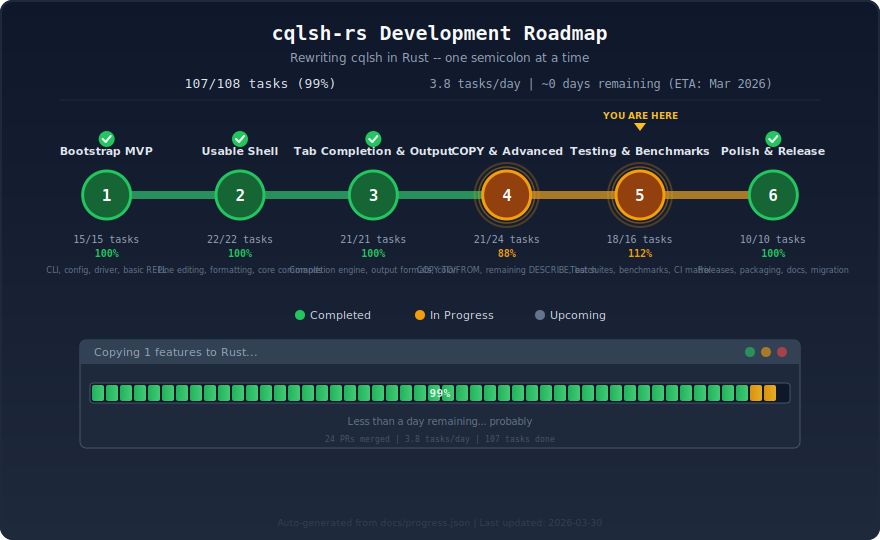

# cqlsh-rs

[](https://github.com/fruch/cqlsh-rs/actions/workflows/ci.yml)
[](https://crates.io/crates/cqlsh-rs)
[](LICENSE)
[](https://ghcr.io/fruch/cqlsh-rs)

A ground-up Rust re-implementation of the Python `cqlsh` — the official interactive CQL shell for [Apache Cassandra](https://cassandra.apache.org/) and compatible databases (ScyllaDB, Amazon Keyspaces, Astra DB).

- **Drop-in replacement** — 100% command-line and configuration compatible with Python cqlsh
- **Single static binary** — no Python, no JVM, no runtime dependencies
- **Cross-platform** — Linux, macOS, and Windows (x86_64 & ARM64)
- **Fast** — sub-millisecond startup, async I/O with Tokio

**[Documentation](https://fruch.github.io/cqlsh-rs/)** | **[API Reference](https://fruch.github.io/cqlsh-rs/api/cqlsh_rs/)** | **[Benchmarks](https://fruch.github.io/cqlsh-rs/dev/bench/)**

## Development Progress

<p align="center">
  
</p>

<details>
<summary>How to update progress</summary>

Edit `docs/progress.json` with updated task counts and velocity data. The roadmap SVG is auto-regenerated when PRs that modify `docs/progress.json` are merged into main.

You can also regenerate locally:
```bash
python3 scripts/generate_progress_svg.py
```
</details>

## Quickstart

```bash
cargo install cqlsh-rs
cqlsh-rs                              # connect to localhost:9042
cqlsh-rs 10.0.0.1 -e "DESCRIBE KEYSPACES"  # one-shot query
```

## Installation

### Homebrew (macOS / Linux)

```bash
brew tap fruch/cqlsh-rs
brew install cqlsh-rs
```

### Cargo (from crates.io)

Requires [Rust](https://www.rust-lang.org/tools/install) 1.70+:

```bash
cargo install cqlsh-rs
```

### Docker

```bash
docker run --rm -it ghcr.io/fruch/cqlsh-rs --version
docker run --rm -it --network host ghcr.io/fruch/cqlsh-rs   # connect to local Cassandra
```

### Pre-built binaries

Download the latest release for your platform from [GitHub Releases](https://github.com/fruch/cqlsh-rs/releases/latest).

Available for: Linux (x86_64, ARM64), macOS (x86_64, Apple Silicon), Windows (x86_64).

Each release includes SHA256 checksums for verification.

### From source

```bash
git clone https://github.com/fruch/cqlsh-rs.git
cd cqlsh-rs
cargo build --release
# binary is at target/release/cqlsh-rs
```

## Usage

```bash
# Connect to localhost:9042 (default)
cqlsh-rs

# Connect to a specific host and port
cqlsh-rs 10.0.0.1 9043

# Execute a single statement and exit
cqlsh-rs -e "SELECT * FROM system.local"

# Execute statements from a file
cqlsh-rs -f schema.cql

# Connect with authentication
cqlsh-rs -u cassandra -p cassandra

# Connect with SSL/TLS
cqlsh-rs --ssl

# Use a specific keyspace
cqlsh-rs -k my_keyspace

# Use a custom cqlshrc configuration file
cqlsh-rs --cqlshrc /path/to/cqlshrc

# Set timeouts
cqlsh-rs --connect-timeout 30 --request-timeout 60
```

### Environment variables

| Variable | Description |
|----------|-------------|
| `CQLSH_HOST` | Default contact point hostname |
| `CQLSH_PORT` | Default native transport port |
| `SSL_CERTFILE` | SSL certificate file path |
| `SSL_VALIDATE` | Enable/disable certificate validation |
| `CQLSH_DEFAULT_CONNECT_TIMEOUT_SECONDS` | Default connect timeout |
| `CQLSH_DEFAULT_REQUEST_TIMEOUT_SECONDS` | Default request timeout |
| `CQL_HISTORY` | Override history file path |

### Configuration file

cqlsh-rs reads `~/.cassandra/cqlshrc` by default (override with `--cqlshrc`). This is the same INI-format configuration file used by the Python cqlsh:

```ini
[authentication]
username = cassandra
password = cassandra

[connection]
hostname = 127.0.0.1
port = 9042
connect_timeout = 5
request_timeout = 10

[ssl]
certfile = /path/to/ca-cert.pem
validate = true

[ui]
color = on
datetimeformat = %Y-%m-%d %H:%M:%S%z
float_precision = 5
encoding = utf-8
```

Configuration precedence: **CLI flags > environment variables > cqlshrc > defaults**.

### Shell completions

Generate shell completion scripts for your shell:

```bash
# Bash
cqlsh-rs --completions bash > /etc/bash_completion.d/cqlsh-rs

# Zsh
cqlsh-rs --completions zsh > ~/.zfunc/_cqlsh-rs

# Fish
cqlsh-rs --completions fish > ~/.config/fish/completions/cqlsh-rs.fish
```

## Project structure

```
src/
├── main.rs                # Entry point
├── lib.rs                 # Library root
├── cli.rs                 # CLI argument parsing (clap v4)
├── config.rs              # cqlshrc parsing & merged configuration
├── error.rs               # Error types (thiserror)
├── session.rs             # Session management
├── repl.rs                # Interactive REPL loop
├── parser.rs              # CQL statement parser
├── completer.rs           # Tab completion engine
├── colorizer.rs           # Syntax highlighting
├── formatter.rs           # Result set formatting (comfy-table)
├── pager.rs               # Output paging
├── describe.rs            # DESCRIBE / DESCRIBE commands
├── copy.rs                # COPY TO / COPY FROM
├── schema_cache.rs        # Schema metadata cache
├── shell_completions.rs   # Shell completion generation
└── driver/                # Database driver abstraction
    ├── mod.rs
    ├── scylla_driver.rs   # scylla-rust-driver backend
    └── types.rs           # CQL type mappings
```

<details>
<summary><h2>Benchmarks</h2></summary>

Performance is tracked continuously via CI. Results are available at:

- **[Historical Dashboard](https://fruch.github.io/cqlsh-rs/dev/bench/)** — Interactive commit-over-commit charts (updated on every merge to main)
- **[Benchmark Workflow Runs](https://github.com/fruch/cqlsh-rs/actions/workflows/bench.yml)** — Grouped benchmark tables and Criterion artifacts posted to each CI run's summary page
- **[Criterion Reports](https://github.com/fruch/cqlsh-rs/actions/workflows/bench.yml)** — Detailed HTML reports uploaded as artifacts on each run (retained 90 days)
- **Rust vs Python** — Hyperfine startup comparison included in each benchmark run's job summary

To run benchmarks locally:

```bash
# Criterion micro-benchmarks
cargo bench --bench startup

# Rust vs Python startup comparison (requires hyperfine + pip install cqlsh)
cargo build --release
scripts/bench_comparison.sh
```

</details>

<details>
<summary><h2>Running tests</h2></summary>

```bash
# Run all tests
cargo test

# Run unit tests only
cargo test --lib

# Run integration tests only
cargo test --test cli_tests
```

</details>

## Contributing

Contributions are welcome! Please open an [issue](https://github.com/fruch/cqlsh-rs/issues) or submit a pull request.

Design documents and implementation plans live in [`docs/plans/`](docs/plans/).

## License

[MIT](LICENSE)
